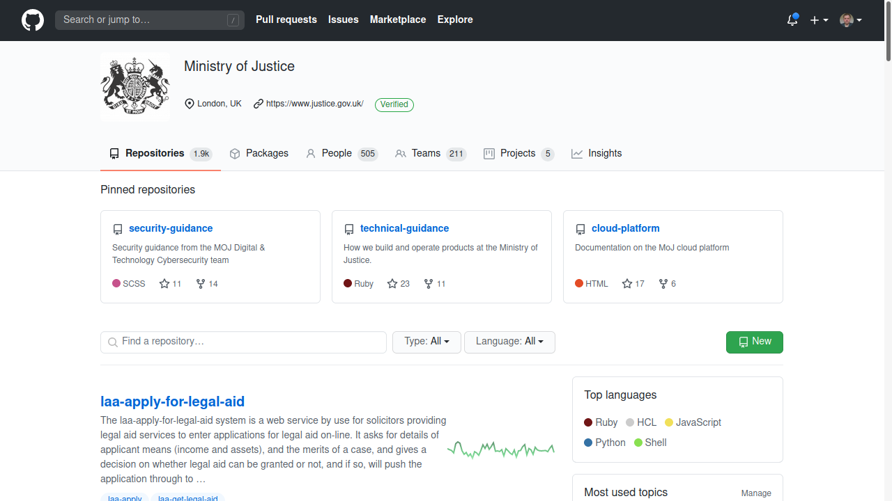
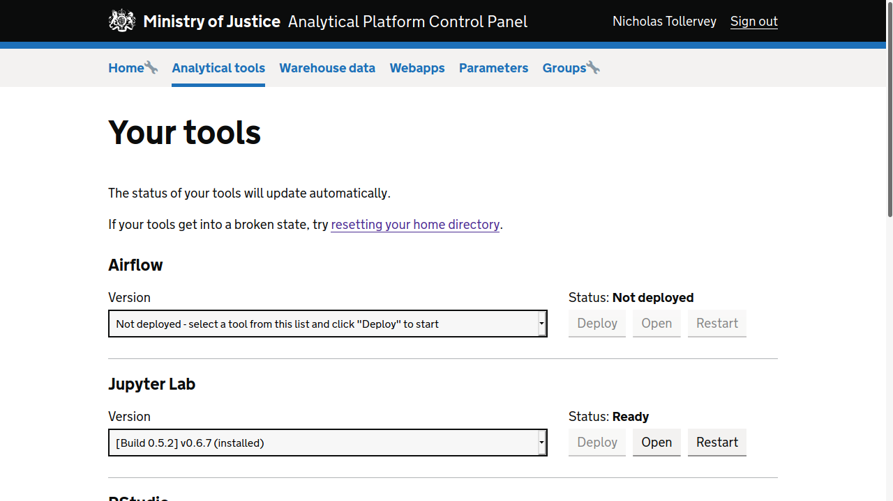

(pause: 3)

This short video introduces the Ministry of Justice's Analytical Platform.

---

To use the platform you need an account on GitHub. You should contact the
Analytical Platform team to be added to the Ministry of Justice on GitHub.

---

Setup credentials with orth zero.

---

Use your two factor app to complete log in.

---

The Analytical Platform brings together browser based tools and data sources
that data scientists and statisticians within the department may need.

(pause: 1)

---

Use Python with Jupiter notebooks.

---

Use your orth zero credentials to log into your Jupiter hub.

---

Once available, simply use Jupiter and Python as you would normally. You can
even configure package requirements and a virtual environment to ensure your
work is easy to reproduce.

---

Alternatively, you can make use of arr and arr studio.

---

Again, use your orth zero credentials to log into arr studio.

---

Wait a few moments as arr studio connects with your browser and sets up your
new session.

(pause: 2)

This may take a little while when you do this for the first time.

---

Start using arr studio as usual.

---

Sometimes you'll see the unidling screen. Go make a coffee and refresh after
a minit or two.

(pause: 1)

We can't predict how long unidling may take.

---

Reset your home directory if arr studio or conda breaks.

---

Select the check box to confirm, and click the reset button.

---

Then click on the restart button to finish the reset procedure.

---

Finally, open arr studio and try again.

---

(pause: 1)

If you need further help or assistance, jusk ask on the analytical
platform support channel on Slack.

(pause: 2)

Best of luck!

(pause: 3)
