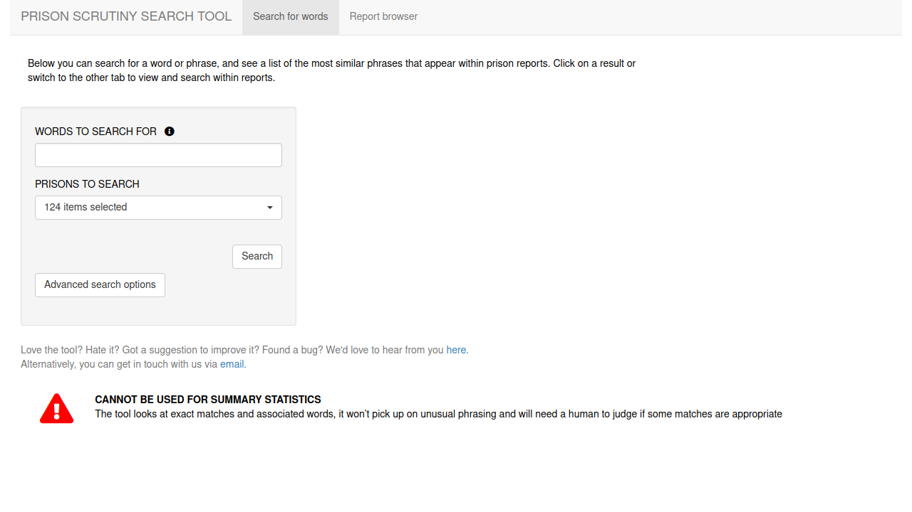

(pause: 1)

The Ministry of Justice's Analytical Platform is a suite of browser based tools for ingesting, storing, analysing and presenting data.
As an analyst, this is the tool you'll use most often.

(pause: 1)

It's developed, supported and operated by the Ministry of Justice's Analytical Platform team, who produced this video.

---

(voice: william)

(pause: 1)

To use the platform sign up for GitHub.
Once set up, email the Analytical Platform team to enable your GitHub account on the platform.

(voice: carol) 

Full details of the sign-up process can be found in the links associated with this video.

---

(voice: elisabeth)

The platform provides open-source analytical software such as `R` Studio and JupiterLab.
> The platform provides open-source analytical software such as `R` Studio and JupyterLab.

(pause: 1)

All your work created with such tools is stored in GitHub.

---

(voice: carol)

'R' Studio is a popular application for writing `R` code and `R` Shiny web apps.

---

(voice: william)

JupiterLab is a Python based data analysis platform that mixes code, data, prose and images.
> JupyterLab is a Python based data analysis platform that mixes code, data, prose and images.

These tools ensure analysis is reproducable and expressed as code.

---

(voice: elisabeth)

Operational databases are available on the Analytical Platform.

This includes data for prisons, probation, and criminal courts.

Analysts are also free to use their own data on the Analytical Platform, subject to the usual data protection considerations.

Please contact our data engineering team who will be happy to advise.

---

(voice: carol) 

(pause: 1)

Interactive apps and web pages can also be built and deployed by analysts, to communicate analysis and insight to decision–makers.

---

(pause: 1)

Web apps are usually created using the `R` Shiny framework.

(pause: 1)

Full instructions for how to build, manage and deploy these apps is available online.

---

(voice: elisabeth)

(pause: 2)

Extensive and detailed documentation is available via the links associated with this video.

(pause: 2)

If you're unsure about what to do or if you encounter a problem, this is definitely the best place to start looking for answers.

---

(voice: william) 

Should you require direct support from a member of the Analytical Platform team, you can always drop into the analytical platform channel in Slack.

Remember to supply your username and describe your problem with as much detail as possible.

---

(pause: 2)

(voice: carol) 

The analytical platform is there to help you get the job done, using best of breed tools, access to relevant data and easy ways to present your results.

(pause: 1)

We hope you enjoy working with the Analytical Platform.

(pause: 2)
